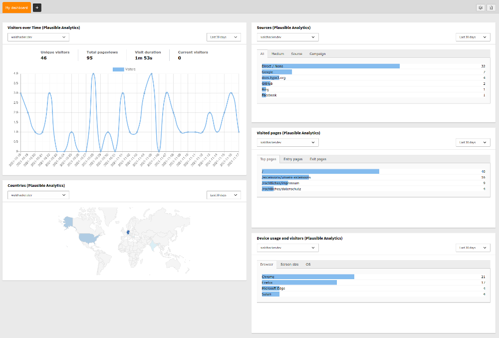
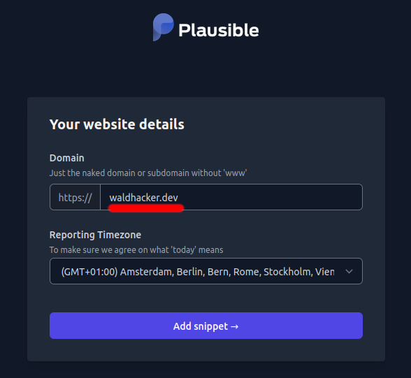
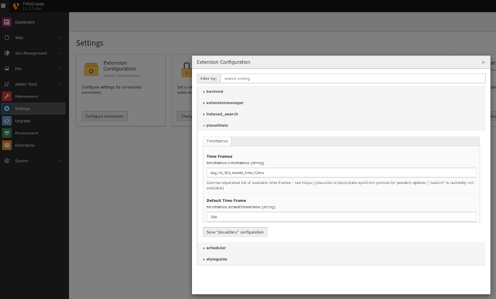

# Privacy-friendly analytics integration for TYPO3 CMS with Plausible Analytics.

Analyze your audience with Plausible Analytics and see nice dashboards with analytics data directly in the TYPO3 backend.

Plausible Analytics is a privacy-friendly, cookieless, lightweight and open-source analytics alternative - you can either use their
service at [https://plausible.io](https://plausible.io) or [self-host the service](https://plausible.io/docs/self-hosting) on your own platform.



## Installation

### With Composer

`composer require waldhacker/typo3-plausibleio`

### Without Composer

- [Download](https://extensions.typo3.org/extension/plausibleio) the extension from the TER
- Install it with the Extension Manager

## Configuration

### Site Language

The extension is mainly configured within the site language `Site Management` / `Sites` / `<site configuration>` / `Languages` / `<site language>` / `Plausible Analytics`


The following settings are available:

#### Plausible API base url

The base URL where the Plausible API endpoints are accessible.  
If you use the plausible.io service it is `https://plausible.io/`.  
If you are using a self-hosted Plausible instance, add your Plausible domain here (like `https://analytics.example.com/`). 

#### Plausible API Key

A Plausible API Token.
If you don't have one yet, you can create one in your Plausible instance at `Settings` / `API keys`


#### Site

A Plausible site ID.  
This is typically your domain or subdomain without `www` (like `waldhacker.dev` or `blog.waldhacker.dev`).  
The Site ID is also the one you entered in your Plausible instance when you created a new site using the `+ Add a website` button.  



#### Auto-Include Plausible tracking snippet

If switched on, then the [Plausible tracking script](https://plausible.io/docs/plausible-script) is automatically included in the frontend.  

If you don't want automatic integration, you can also insert the script manually using the asset collector within your templates like this:

```
<f:asset.script identifier="analytics" src="https://plausible.io/js/plausible.js" data="{'domain':'waldhacker.dev'}" priority="1" async="async" defer="defer" />
```

#### Plausible tracking snippet Base URL

The base URL where the Plausible Plausible tracking scripts are accessible.  
It must be the part before `js/plausible.js`. So if your Plausible tracking scripts are available at `https://analytics.example.com/js/plausible.js` then put `https://analytics.example.com/` here.  
If you use the plausible.io service it is `https://plausible.io/`.  

The URL is most likely the same as the "Plausible API base url". However, it may happen that the tracking script should be loaded from another domain [because of adblockers](https://plausible.io/docs/proxy/introduction). Therefore the Plausible tracking scripts base URL must be configured separately here.

#### Plausible tracking snippet Type

Plausible [offers different tracking scripts](https://plausible.io/docs/script-extensions) for various use cases.  
One of these scripts can be selected here (the default ist `plausible.js`).

### Extension configuration

Some options are configured within the extension configuration at `Admin Tools` / `Extension Configuration` / `plausibleio`



#### Time Frames 

Comma-separated list of available selectable time frames within the dashboard widgets - see [https://plausible.io/docs/stats-api#time-periods](https://plausible.io/docs/stats-api#time-periods) for possible options ("custom" is currently not available).

#### Default Time Frame 

The time frame to use initially when rendering the widgets.

###Advanced configuration

#### Service.yaml

If you want to see multiple widgets with preconfigured values on one dashboard, this is possible via the widget configuration in the file `Configuration/Services.yaml`.  
So it is possible to create e.g. the `Countries` widget 2 times on the dashboard. One which shows the country map for `site1.example.com` and one which shows the country map for `site2.example.com`.

Copy the `waldhacker.plausibleio.widget.country` widget from the file `EXT:plausibleio/Configuration/Services.yaml`

```
  waldhacker.plausibleio.widget.country:
    class: 'Waldhacker\Plausibleio\Dashboard\Widget\CountryMapDataWidget'
    arguments:
      $view: '@dashboard.views.widget'
      $configurationService: '@Waldhacker\Plausibleio\Services\ConfigurationService'
      $options:
        siteId: null
        timeFrame: null
    tags:
      - name: dashboard.widget
        identifier: 'plausible.countrymapdata'
        groupNames: 'plausibleio'
        title: 'LLL:EXT:plausibleio/Resources/Private/Language/locallang.xlf:widget.countryMapData.label'
        description: 'LLL:EXT:plausibleio/Resources/Private/Language/locallang.xlf:widget.countryMapData.description'
        iconIdentifier: 'content-widget-chart-bar'
        height: 'medium'
        width: 'medium'
```

into your site package `Configuration/Services.yaml` file and adjust the configuration like this

```
  # Countries widget fixed to site1.example.com
  yourname.plausibleio.widget.country.site1:
    class: 'Waldhacker\Plausibleio\Dashboard\Widget\CountryMapDataWidget'
    arguments:
      $view: '@dashboard.views.widget'
      $configurationService: '@Waldhacker\Plausibleio\Services\ConfigurationService'
    $options:
      siteId: site1.example.com
      timeFrame: 30d
  tags:
    - name: dashboard.widget
      identifier: 'yourname.countrymapdata'
      groupNames: 'plausibleio'
      title: 'LLL:EXT:yourpackage/Resources/Private/Language/locallang.xlf:widgets.countryMapData.label'
      description: 'LLL:EXT:yourpackage/Resources/Private/Language/locallang.xlf:widgets.countryMapData.description'
      iconIdentifier: 'content-widget-chart-bar'
      height: 'medium'
      width: 'medium'

  # Countries widget fixed to site2.example.com
  yourname.plausibleio.widget.country.site2:
    class: 'Waldhacker\Plausibleio\Dashboard\Widget\CountryMapDataWidget'
    arguments:
      $view: '@dashboard.views.widget'
      $configurationService: '@Waldhacker\Plausibleio\Services\ConfigurationService'
    $options:
      siteId: site2.example.com
      timeFrame: 30d
  tags:
    - name: dashboard.widget
      identifier: 'yourname.countrymapdata'
      groupNames: 'plausibleio'
      title: 'LLL:EXT:yourpackage/Resources/Private/Language/locallang.xlf:widgets.countryMapData.label'
      description: 'LLL:EXT:yourpackage/Resources/Private/Language/locallang.xlf:widgets.countryMapData.description'
      iconIdentifier: 'content-widget-chart-bar'
      height: 'medium'
      width: 'medium'
```

Within `$options` you have the possibility to fix a widget to a plausible site ID and/or to a time frame.
